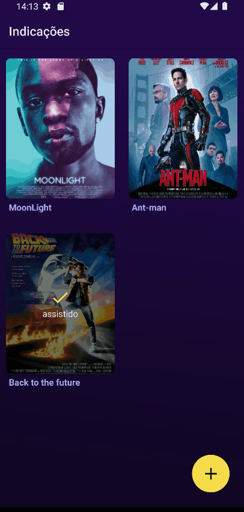

# Indications list

A app to save the indications of movies.




### Thanks for the awesome libs

- [react-native](https://reactnative.dev/)
- [expo](https://expo.dev/)
- [expo-linear-gradient](https://docs.expo.dev/versions/latest/sdk/linear-gradient/)
- [react-native-awesome-alerts](https://github.com/rishabhbhatia/react-native-awesome-alerts)
- [react-native-dotenv](https://github.com/goatandsheep/react-native-dotenv)
- [axios](https://github.com/axios/axios)
- [react-hook-form](https://github.com/react-hook-form/react-hook-form)
- [react-native-fast-image](https://github.com/DylanVann/react-native-fast-image)
- [react-native-get-random-values](https://github.com/LinusU/react-native-get-random-values)
- [react-native-image-picker](https://github.com/react-native-image-picker/react-native-image-picker)
- [@react-navigation/native](https://github.com/react-navigation/react-navigation)
- [react-native-snackbar](https://github.com/cooperka/react-native-snackbar)
- [styled-components](https://github.com/styled-components/styled-components)

# ❗️ Requirements

- [Node.js](https://nodejs.org/en/)
- [Yarn](https://classic.yarnpkg.com/en/) (Optional).
- [React-native setup environment](https://reactnative.dev/docs/environment-setup)


## install the dependencies
```
yarn install
```

#### copy the file .env.example to .env and change the configs as you need

#### execute json-server (keep running - its a fake api)
```
yarn json-server server.example.json
```

#### finally in other terminal run the app
```
yarn android
```

#### To do
- [ ] use theme files
- [ ] search and filter indications
- [ ] share indications
- [ ] test in iOS
- [ ] ...


This app is also an activity for my postgraduate at [Faculdade Unyleya](https://unyleya.edu.br/)
discipline "Desenvolvimento Multiplataforma com React Native" by tutor Wesley Bruno Barbosa Silva

Made with 💜 by [Silas P Ladislau](https://www.linkedin.com/in/silas-pinho-ladislau-2993b329)